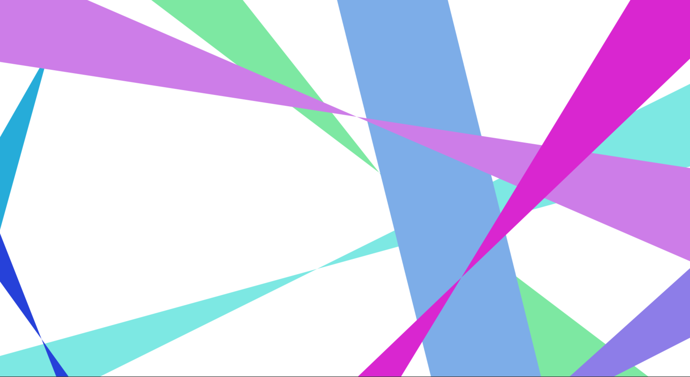

# colorstrip

Web display of crossing, moving bands of color



## Usage

`npm install --save @mathieucaroff/colorstrip`

OR

`yarn add @mathieucaroff/colorstrip`

then:

```ts
let canvas = document.querySelector("canvas")

let strip = createColorStrip(canvas, {
  diversityRatio: 0.25,
  radiusFactor: 1,
  secondaryRadiusFactor: 1,
  speedFactor: 1,
  paletteSeed: Math.floor(Math.random() * 2 ** 32),
  stripCircleSeed: Math.floor(Math.random() * 2 ** 32),
  stripCount: 10,
  theme: "pastelle",
})

// strip.draw(0)
strip.play()
```

## Developement

### Setup

```sh
yarn install
```

### Running it in development mode

```sh
yarn dev
```

### Build

```sh
yarn build
```
